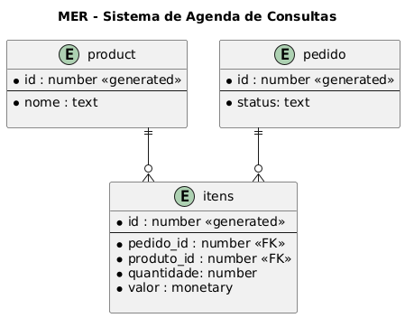

# ☕︎ Study API

API Java com Spring Boot para estudos

## 📃 MER



## 🔧 Instalação

* Limpar e criar a pasta */target*

```
mvn clean package
```

* Configuração do Swagger

    - https://springdoc.org/properties.html

- application.properties

```
springdoc.swagger-ui.path=/
springdoc.swagger-ui.disable-swagger-default-url=true
```


## 🌐 Navegação

### Executar a API

-  *Executando* **Maven**

```
mvn spring-boot:run
```

## 📖 Documentação da API (Swagger)
- http://localhost:8080/swagger-ui.html


## 📓 Referencias

- https://springdoc.org/

## 📚 Descrição de Branches
|**main**       |**uc-http-codes**  | **uc-service-crud** |
|----------------|---------|--------|
|Código completo até o momento	     |Início do conteúdo (código base)| CRUD completo |
